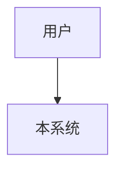
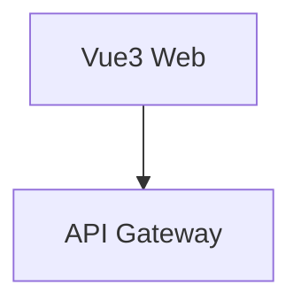

---
# 基础布局模板 — 所有文档类型继承此模板
# 包含文档头/尾的通用结构
---

> **Alive Engineering Standard** — 自动生成文档
> 版本：1.0 | 生成器版本：1.0.0 | 生成日期：2026-06-28

---

# 架构设计：系统架构

> 版本：1.0 | 状态：草稿 | 架构师：系统架构师
> 创建日期：2026-06-28

---

## 1. 架构概览

### 1.1 上下文图

### 1.2 容器图

## 2. 架构决策

### ADR-1：技术栈选型
- **状态**：已接受
- **背景**：需要确定后端技术栈
- **方案**：采用 Spring Boot 3.x
- **备选方案**：
  - Spring Boot（已选）：团队经验丰富
  - Go（未选）：学习成本高
- **后果**：开发效率高，生态成熟

## 3. 模块职责

| 模块 | 职责 | 技术栈 |
|------|------|--------|
| API Gateway | 请求路由和认证 | Spring Cloud Gateway |
| User Service | 用户管理 | Spring Boot |

## 4. 关键技术选型

| 领域 | 选型 | 版本 | 理由 |
|------|------|------|------|
| 编程语言 | Java | 21 | LTS 版本 |
| 框架 | Spring Boot | 3.2 | 生态成熟 |

---

---
> 本文档由 AES 文档生成器自动生成
> 最后更新：2026-06-28 | 版本：1.0
