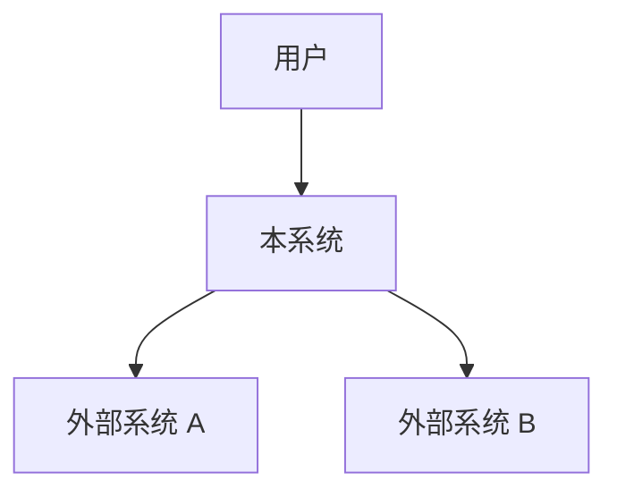
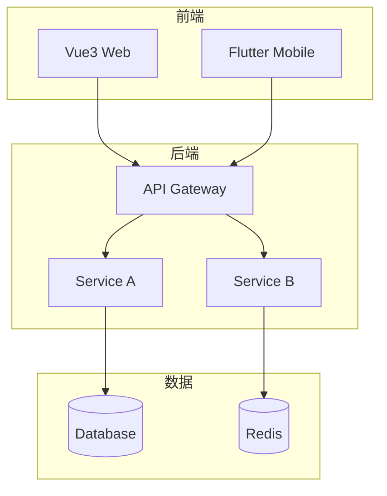
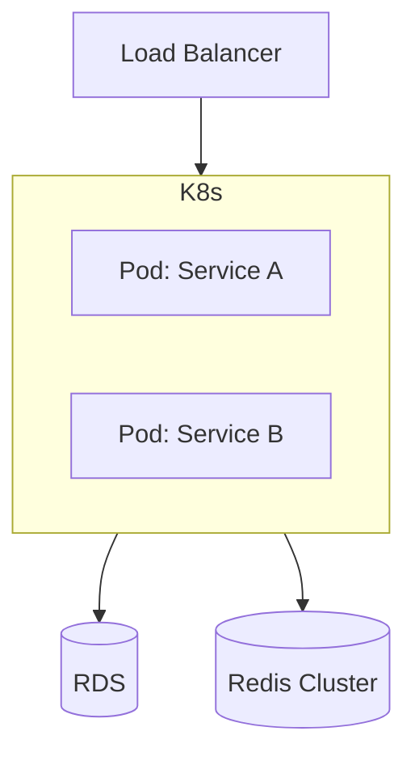

# 架构设计：[系统/模块名称]

> 版本：1.0 | 状态：草稿/已评审/已定稿
> 创建日期：YYYY-MM-DD | 架构师：[姓名]

---

## 1. 架构概览

### 1.1 上下文图（C4 Context）

### 1.2 容器图（C4 Container）

## 2. 架构决策（ADR）

### ADR-001：[决策标题]
- **状态**：已接受/已提议/已废弃
- **背景**：[为什么需要这个决策]
- **方案**：[选择的方案]
- **备选方案**：
  - 方案 A（已选）：[理由]
  - 方案 B：[不选理由]
- **后果**：[选择后的影响]

### ADR-002：[决策标题]

## 3. 模块职责

| 模块 | 职责 | 技术栈 | 负责人 |
|------|------|--------|--------|
| [模块名] | [职责描述] | [技术栈] | [负责人] |

## 4. 关键技术选型

| 领域 | 选型 | 版本 | 理由 |
|------|------|------|------|
| 编程语言 | [语言] | [版本] | [理由] |
| 框架 | [框架] | [版本] | [理由] |
| 数据库 | [数据库] | [版本] | [理由] |
| 消息队列 | [MQ] | [版本] | [理由] |

## 5. 部署架构

## 6. 安全架构

- **认证方式**：JWT / OAuth2 / Session
- **鉴权模型**：RBAC / ABAC
- **数据加密**：TLS / AES-256
- **网络安全**：VPC / WAF / VPN

## 7. 扩展性考虑

- **水平扩展**：[如何扩]
- **垂直扩展**：[如何扩]
- **未来架构演进**：[方向]

## 8. 附录

- C4 模型图：[链接]
- 部署拓扑图：[链接]
- 相关 PRD：[链接]
