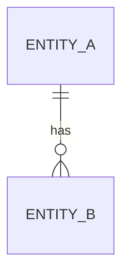

---
# 基础布局模板 — 所有文档类型继承此模板
# 包含文档头/尾的通用结构
---

> **Alive Engineering Standard** — 自动生成文档
> 版本：1.0 | 生成器版本：1.0.0 | 生成日期：2026-06-28

---

# 实体关系设计：数据模型

> 版本：1.0 | 最后更新：2026-06-28

---

## 1. 实体总览

## 2. 实体定义

### 实体 A (`t_entity_a`)
| 字段 | 类型 | 约束 | 说明 |
|------|------|------|------|
| `id` | UUID | PK | 主键 |
| `name` | VARCHAR(255) | NOT NULL | 名称 |

**索引**：
- `idx_entity_a_name` ON `name`

## 3. 关系矩阵

| 实体 A | 关系 | 实体 B | 说明 |
|--------|------|--------|------|
| 实体 A | 1:N | 实体 B | 拥有关系 |

---

---
> 本文档由 AES 文档生成器自动生成
> 最后更新：2026-06-28 | 版本：1.0
