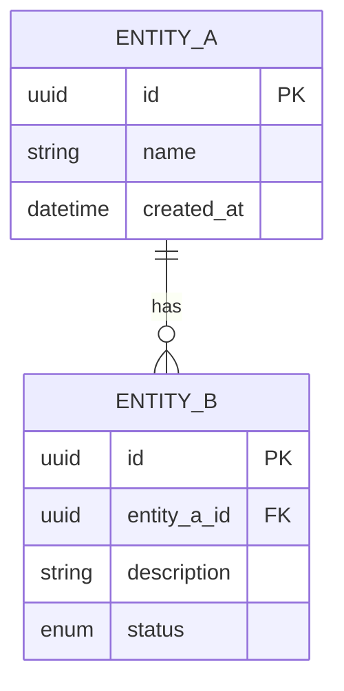

# 实体关系设计：[模块名称]

> 版本：1.0 | 最后更新：YYYY-MM-DD

---

## 1. 实体总览

## 2. 实体定义

### 2.1 [实体名称] (`table_name`)

| 字段 | 类型 | 约束 | 说明 |
|------|------|------|------|
| `id` | UUID | PK, NOT NULL | 主键 |
| `field_1` | VARCHAR(255) | NOT NULL | 字段说明 |
| `field_2` | INTEGER | DEFAULT 0 | 字段说明 |
| `status` | VARCHAR(20) | NOT NULL | 枚举值：[状态列表] |
| `created_at` | TIMESTAMP | NOT NULL | 创建时间 |
| `updated_at` | TIMESTAMP | NOT NULL | 更新时间 |

**索引**：
- `idx_table_field` ON `field_1`
- `idx_table_status` ON `status`

### 2.2 [实体名称] (`table_name`)

## 3. 关系矩阵

| 实体 A | 关系 | 实体 B | 说明 |
|--------|------|--------|------|
| [实体A] | 1:N | [实体B] | [说明] |
| [实体B] | N:M | [实体C] | 通过关联表 [关联表] |

## 4. 枚举定义

### `entity_status`
| 值 | 说明 | 排序 |
|----|------|------|
| `ACTIVE` | 激活 | 1 |
| `INACTIVE` | 未激活 | 2 |
| `ARCHIVED` | 归档 | 3 |

## 5. 数据量预估

| 表 | 日增长量 | 年总量 | 清理策略 |
|----|----------|--------|----------|
| [表名] | [行数] | [行数] | [策略] |

## 6. 附录

- 完整 SQL DDL：[链接]
- 迁移脚本：[链接]
