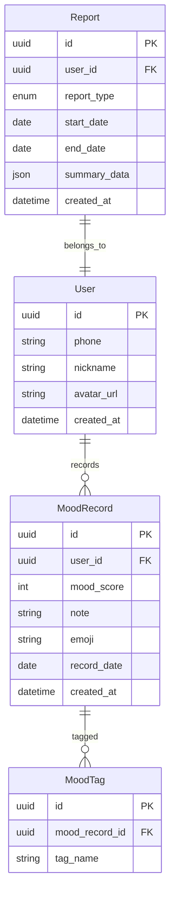

# 《还活着》MVP 规划

> 版本：1.0 | 状态：定稿 | 最后更新：2026-06-28

---

## 1. MVP 范围

### 核心定位
《还活着》—— 情感追踪与人生记录平台。用户每日记录情绪状态，生成周/月/年度情感报告。

### MVP 模块清单

| 模块 | 优先级 | 说明 | 依赖 |
|------|--------|------|------|
| `alive-user` | P0 | 用户注册/登录/个人信息 | 无 |
| `alive-mood` | P0 | 情绪记录、打卡、历史查询 | `alive-user` |
| `alive-report` | P0 | 周/月/年度情感报告生成 | `alive-mood` |
| `alive-share` | P1 | 报告分享（图片/链接） | `alive-report` |
| `alive-gateway` | P0 | API 网关、认证、限流 | 无 |
| `alive-common` | P0 | 公共库（工具类、异常、常量） | 无 |
| `mobile-flutter` | P0 | 用户端 Flutter App | 全部后端 |
| `admin-vue3` | P1 | 管理后台 | `alive-user`, `alive-mood` |

### 非 MVP 模块（后续迭代）
- `alive-ai`：AI 情感分析、智能建议
- `alive-game`：情感游戏化
- `alive-boss`：企业版管理
- `alive-certificate`：电子证书
- `alive-vip`：会员系统
- `alive-operation`：运营工具
- 小程序端

## 2. 模块目录结构

### 2.1 alive-gateway

```
backend/alive-gateway/
├── src/main/java/com/alive/gateway/
│   ├── config/          # 网关配置（路由、CORS、限流）
│   ├── filter/          # 过滤器（认证、日志、限流）
│   ├── handler/         # 异常处理器
│   └── AliveGatewayApplication.java
├── src/main/resources/
│   ├── application.yml
│   └── bootstrap.yml
├── pom.xml
└── Dockerfile
```

### 2.2 alive-user

```
backend/alive-user/
├── src/main/java/com/alive/user/
│   ├── controller/
│   │   └── UserController.java
│   ├── service/
│   │   └── UserService.java
│   ├── domain/
│   │   └── User.java
│   ├── repository/
│   │   └── UserRepository.java
│   ├── dto/
│   │   ├── LoginRequest.java
│   │   ├── RegisterRequest.java
│   │   └── UserResponse.java
│   ├── security/
│   │   ├── JwtProvider.java
│   │   └── PasswordEncoder.java
│   └── AliveUserApplication.java
├── src/main/resources/
│   ├── application.yml
│   └── db/migration/
│       └── V1__init_user.sql
├── pom.xml
├── Dockerfile
└── build.gradle
```

### 2.3 alive-mood

```
backend/alive-mood/
├── src/main/java/com/alive/mood/
│   ├── controller/
│   │   └── MoodController.java
│   ├── service/
│   │   ├── MoodService.java
│   │   └── MoodAnalysisService.java
│   ├── domain/
│   │   ├── MoodRecord.java
│   │   └── MoodTag.java
│   ├── repository/
│   │   ├── MoodRepository.java
│   │   └── MoodTagRepository.java
│   ├── dto/
│   │   ├── MoodCreateRequest.java
│   │   ├── MoodUpdateRequest.java
│   │   └── MoodResponse.java
│   └── AliveMoodApplication.java
├── src/main/resources/
│   ├── application.yml
│   └── db/migration/
│       ├── V1__init_mood.sql
│       └── V2__init_mood_tag.sql
├── pom.xml
└── Dockerfile
```

### 2.4 alive-report

```
backend/alive-report/
├── src/main/java/com/alive/report/
│   ├── controller/
│   │   └── ReportController.java
│   ├── service/
│   │   ├── ReportService.java
│   │   ├── WeeklyReportGenerator.java
│   │   ├── MonthlyReportGenerator.java
│   │   └── ReportShareService.java
│   ├── domain/
│   │   ├── Report.java
│   │   └── ReportTemplate.java
│   ├── repository/
│   │   └── ReportRepository.java
│   ├── dto/
│   │   ├── ReportSummary.java
│   │   └── ReportDetail.java
│   └── AliveReportApplication.java
├── src/main/resources/
│   ├── application.yml
│   └── db/migration/
│       └── V1__init_report.sql
├── pom.xml
└── Dockerfile
```

### 2.5 alive-common

```
backend/alive-common/
├── src/main/java/com/alive/common/
│   ├── exception/
│   │   ├── BusinessException.java
│   │   └── GlobalExceptionHandler.java
│   ├── response/
│   │   └── ApiResponse.java
│   ├── util/
│   │   ├── DateUtils.java
│   │   └── JsonUtils.java
│   └── constant/
│       └── ApiConstants.java
├── pom.xml
└── README.md
```

### 2.6 mobile-flutter

```
apps/mobile-flutter/
├── lib/
│   ├── main.dart
│   ├── app.dart
│   ├── core/
│   │   ├── api/          # Dio 实例、拦截器
│   │   ├── router/       # GoRouter 路由
│   │   ├── theme/        # 主题、配色
│   │   ├── storage/      # 本地存储
│   │   └── constants/    # 常量
│   ├── common/
│   │   ├── widgets/      # 通用组件
│   │   └── extensions/   # 扩展方法
│   └── features/
│       ├── auth/         # 登录/注册
│       │   ├── models/
│       │   ├── services/
│       │   ├── screens/
│       │   └── widgets/
│       ├── mood/         # 情绪记录
│       │   ├── models/
│       │   │   ├── mood_record.dart
│       │   │   └── mood_tag.dart
│       │   ├── services/
│       │   │   └── mood_service.dart
│       │   ├── screens/
│       │   │   ├── mood_create_screen.dart
│       │   │   ├── mood_history_screen.dart
│       │   │   └── mood_detail_screen.dart
│       │   └── widgets/
│       │       ├── mood_emoji_picker.dart
│       │       └── mood_card.dart
│       ├── report/       # 报告
│       │   ├── models/
│       │   ├── services/
│       │   ├── screens/
│       │   └── widgets/
│       └── profile/      # 个人中心
│           ├── models/
│           ├── services/
│           ├── screens/
│           └── widgets/
├── test/
├── pubspec.yaml
├── analysis_options.yaml
└── Dockerfile
```

### 2.7 admin-vue3

```
apps/admin-vue3/
├── src/
│   ├── api/
│   │   ├── user.ts
│   │   └── mood.ts
│   ├── components/
│   │   └── common/
│   ├── layouts/
│   │   └── AdminLayout.vue
│   ├── pages/
│   │   ├── dashboard/
│   │   ├── user/
│   │   └── mood/
│   ├── router/
│   │   └── index.ts
│   ├── stores/
│   │   ├── user.ts
│   │   └── app.ts
│   ├── styles/
│   │   └── variables.scss
│   └── utils/
│       └── request.ts
├── package.json
├── vite.config.ts
└── Dockerfile
```

## 3. 实体关系



## 4. API 端点（MVP）

### 4.1 用户服务 (`/api/v1/user`)
| 方法 | 路径 | 说明 |
|------|------|------|
| POST | `/api/v1/user/register` | 注册 |
| POST | `/api/v1/user/login` | 登录 |
| GET | `/api/v1/user/profile` | 个人信息 |
| PUT | `/api/v1/user/profile` | 更新信息 |

### 4.2 情绪服务 (`/api/v1/mood`)
| 方法 | 路径 | 说明 |
|------|------|------|
| POST | `/api/v1/mood` | 创建情绪记录 |
| GET | `/api/v1/mood` | 情绪列表（分页） |
| GET | `/api/v1/mood/{id}` | 情绪详情 |
| GET | `/api/v1/mood/calendar` | 日历视图数据 |
| GET | `/api/v1/mood/stats` | 统计数据 |

### 4.3 报告服务 (`/api/v1/report`)
| 方法 | 路径 | 说明 |
|------|------|------|
| GET | `/api/v1/report/weekly` | 周报 |
| GET | `/api/v1/report/monthly` | 月报 |
| GET | `/api/v1/report/yearly` | 年报 |
| POST | `/api/v1/report/share` | 生成分享 |

## 5. 里程碑

| 里程碑 | 日期 | 交付物 |
|--------|------|--------|
| M1 | 第 1-2 周 | 基础设施：gateway + common + 数据库初始化 |
| M2 | 第 3-4 周 | 用户系统：注册/登录 + Flutter 登录页 |
| M3 | 第 5-6 周 | 情绪记录：CRUD + Flutter 打卡页 |
| M4 | 第 7-8 周 | 报告系统：周/月报生成 + Flutter 报告页 |
| M5 | 第 9-10 周 | 管理后台：用户管理 + 数据概览 |
| M6 | 第 11-12 周 | MVP 联调 + 上线准备 |
