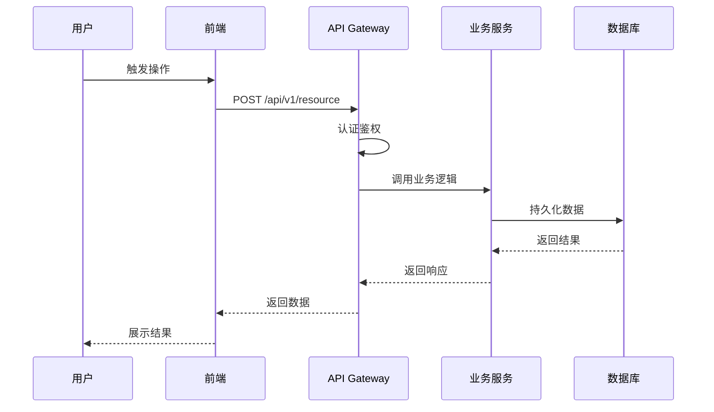
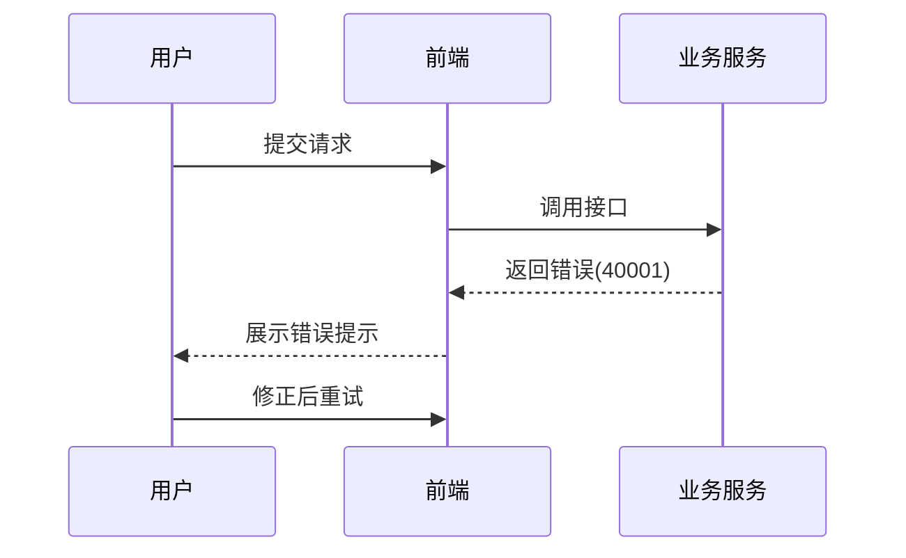
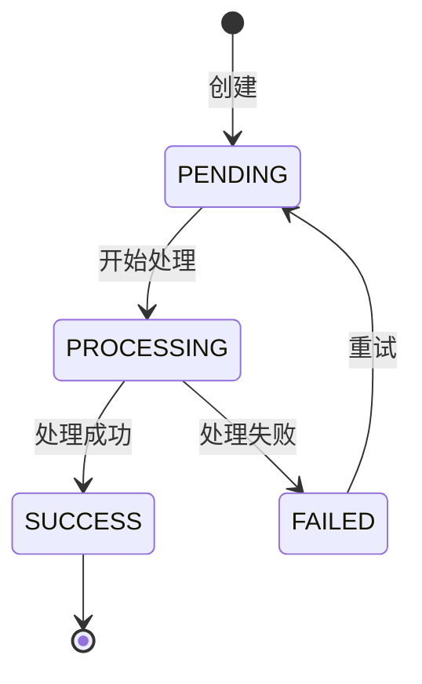

# 时序图：[业务流程名称]

> 版本：1.0 | 最后更新：YYYY-MM-DD

---

## 1. 业务流程

### 1.1 [流程名称]

```mermaid
sequenceDiagram
    participant User as 用户
    participant UI as 前端
    participant Gateway as API Gateway
    participant Service as 业务服务
    participant DB as 数据库

    User->>UI: 触发操作
    UI->>Gateway: POST /api/v1/resource
    Gateway->>Gateway: 认证鉴权
    Gateway->>Service: 调用业务逻辑
    Service->>DB: 持久化数据
    DB-->>Service: 返回结果
    Service-->>Gateway: 返回响应
    Gateway-->>UI: 返回数据
    UI-->>User: 展示结果
```

### 1.2 [流程名称]

## 2. 异常流程

### 2.1 [异常场景]

```mermaid
sequenceDiagram
    participant User as 用户
    participant UI as 前端
    participant Service as 业务服务
    
    User->>UI: 提交请求
    UI->>Service: 调用接口
    Service-->>UI: 返回错误(40001)
    UI-->>User: 展示错误提示
    User->>UI: 修正后重试
```

## 3. 状态流转

```mermaid
stateDiagram-v2
    [*] --> PENDING: 创建
    PENDING --> PROCESSING: 开始处理
    PROCESSING --> SUCCESS: 处理成功
    PROCESSING --> FAILED: 处理失败
    SUCCESS --> [*]
    FAILED --> PENDING: 重试
```

## 4. 附录

- 完整流程图：[链接]
- 相关 PRD：[链接]
