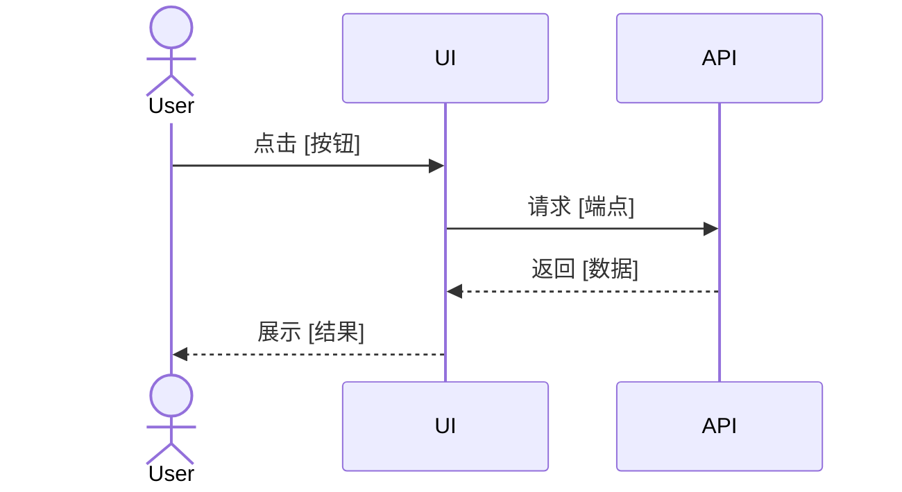

# UI 设计：[页面/功能名称]

> 版本：1.0 | 平台：Flutter / Vue3 | 最后更新：YYYY-MM-DD

---

## 1. 页面清单

| 页面 | 路由 | 说明 | 状态 |
|------|------|------|------|
| [页面名称] | /path/to/page | [说明] | 设计中/开发中/已完成 |

## 2. 设计规范

### 2.1 引用设计令牌
- 主色：`--color-primary: #4F46E5`
- 字体：`--font-family: Inter, sans-serif`
- 圆角：`--radius-md: 8px`

### 2.2 组件引用
- 按钮：使用 `Button` 组件（`primary` / `secondary` / `ghost`）
- 输入框：使用 `Input` 组件
- 卡片：使用 `Card` 组件

## 3. 页面原型

### 3.1 [页面名称]
**布局结构**：
```
+----------------------------------+
|  Header (Logo + Nav)             |
+----------------------------------+
|  Sidebar  |  Main Content        |
|           |                      |
|  - Nav 1  |  [Content Area]      |
|  - Nav 2  |                      |
|  - Nav 3  |                      |
+----------------------------------+
|  Footer                          |
+----------------------------------+
```

**状态说明**：
- 加载态：Skeleton 占位
- 空态：空状态插图 + "暂无数据" 文案
- 错误态：错误提示 + 重试按钮
- 边界态：长文本截断、大列表虚拟滚动

### 3.2 [页面名称]

## 4. 交互流



## 5. 路由设计

| 路径 | 页面 | 参数 | 动画 |
|------|------|------|------|
| `/resource` | 列表页 | - | fade |
| `/resource/:id` | 详情页 | `id` | slide |

## 6. 附录

- Figma 链接：[链接]
- 组件库文档：[链接]
